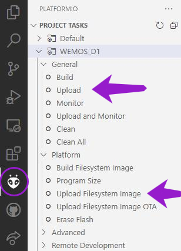

# Welcome to the SMuFF-WI-ESP project

This is the firmware source code for SMuFF-WI-ESP, which is used in the [SMuFF project](https://github.com/technik-gegg/SMuFF-1.1).
[SMuFF-WI](https://github.com/technik-gegg/SMuFF-WI) is a browser based interface to control and configure your SMuFF in a much more convenient way from within your Computer and is hosted on Github.

In order to make the SMuFF-WI a local entity, this project utilizes an **Wemos D1 mini R2** (ESP8266) as the controller, which is intended to be used along the [SMuFF-Backbone](https://sites.google.com/view/the-smuff/work-in-progress?authuser=0#h.lsp6q12gba4c) board. Though, it can easily be used without the SMuFF-Backbone, if needed.

>**Keep in mind:** Although the web page on this device runs locally, it'll access different ressources on the internet, such as the JQuery library or some images located in the Github repository for the SMuFF-WI project. This simply is because those ressources are pretty large in (file-) size and hence could overload the internal file system easily.

---

# Compiling / uploading

In order to compile this firmware and flash it onto the WEMOS D1 mini, you have to load it up in **PlatformIO** and run the *Upload* command from the **WEMOS_D1** *Project Task*, which will automatically build the binaries beforehand.
For the very first build you also need to execute the *Upload Filesystem Image*, since the file system contains all the files needed to run the web server.



>**Keep in mind:** You will need to upload the *Filesystem Image* each time the WebInterface is getting updated.
**However,** once you've flashed the firmware/file system successfully onto the device, you'll be able to upload the binaries directly via the integrated web-interface. With future updates there's no need to fire up VS-Code / PlatformIO as long as you've got those said binaries.

[](https://open.vscode.dev/technik-gegg/SMuFF-WI-ESP/master)

---

# Installing the device

Since the SMuFF-WI-ESP is meant to be used on the SMuFF-Backbone PCB, there's a dedicated socket where you're supposed to plug it in (**U4**).

If you'd like to run that device without the SMuFF-Backbone, simply wire it up to the **TFT-Serial** header on your SMuFF-Controller board (e.g. SKR E3 V3). You need to manually wire up the PWR (5V), GND, RX and TX signals only, using 4 DuPont wires.

>**Keep in mind:** the TX and RX signals need to be crossed over, i.e. the TX pin on the TFT-Serial header goes to the RX pin on the Wemos D1 mini, vice versa, RX pin on the TFT-Serial header needs to go to the TX pin.
Please make sure you connect the 5V power wire to the according **5V input pin** of the Wemos D1 mini **and not the 3.3V pin** (because that' wi'll release the "Magic Smoke" feature instantly).


Please notice, for some new features on the SMuFF (Filament-Dryer - in firmware >= 3.30), one has the option to attach a **4 LED NeoPixel strip** to pin **D5** of the Wemos D1 mini, which connects with the **DIN** (Data Input) pin of the NeoPixels strip (and also +5V/GND, of course).
This will give you a visual feedback of the heater heating / cooling state, if you decide to do so.

---

# Setting it up

For setting the device up, you have to connect your PC to the *SMuFF-WI_xxxxxx* WiFi hotspot once and allow the device to connect to your wireless network using the built-in [WiFiManager](https://github.com/tzapu/WiFiManager) via the static IP address **192.168.4.1**.

As soon as you have saved your local network details and credentials, the device will restart and connect to your configured WiFi network, which eventually will assign a new IP address to it. You can query your Router/Access Point in order to retrieve the new IP address or, use some network tool and look out for a device named **SMuFF-WI_xxxxxx**.

Enter the new address in your browser and it'll greet you with the default [SMuFF-WI](https://github.com/technik-gegg/SMuFF-WI) startup screen.

>**Hint:** If you need to connect the device to another WiFi hotspot, you'll need to reset the existing connection/credentials first.
To do so, open the URL **http://{IP-Address}/reset?v=wifi** in your browser. This will erase the current settings and the device will go back into "Portal mode", where it sets up it's own AP that will be accessible under the IP-Address **192.168.4.1** once you've connected with the AP named *SMuFF-WI_xxxxxx*.

---

# Troubleshooting

If your SMuFF-WI-ESP device doesn't show the default web page for some reason, you have the option to see the debug output by attaching a TTL2USB interface (TX/GND) to pin D5/GND of the Wemos D1 mini (*see Wiring in picture above*) and view the messages sent via a Terminal app (e.g. [TeraTerm](https://teratermproject.github.io/index-en.html)), which you have to set up for **19200 Baud** on the according COM port.

If you're successful, you're supposed to see something like this in your Terminal app at startup:

```text
Serial 2 (UART) initialized at 19200 Baud
Serial 1 initialized at 115200 Baud
--------------------
SMuFF-WI-ESP Version 1.x.x (ESP8266)

Starting...
FS init...  ok
Webserver init...
WiFi connected
MDNS set to: SMuFF-WI-ESP_xxxxxx
NetBios set to: SMuFF-WI-ESP_xxxxxx
Webserver running
WebSocketsServer running
```

---

## Recent changes

**1.0.0** - Initial commit
